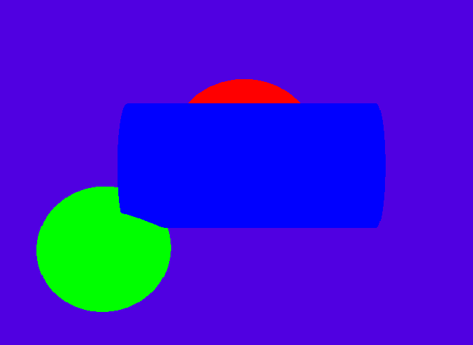

A small ray-tracing program, that shows 3 types of geometric figures 
in a 3D space: spheres, cylinders and planes of infinite dimensions.
With rotating camera to give the viewer the perspective, and different
lights for more realism.

The user can choose the rotation and position of the camera, 
the ambient light, the direction of the light rays, as well as
the colors of the figures and their dimensions... In specific
files (placed in the in "scenes" folder).

Once the executable has been created ("make" command), and 
the scene file has been given as a parameter,
a specific 3D scene will be displayed on a window.

* Works only on Linux 
* with these libraries installed: 
* sudo apt install libx11-dev 
* sudo apt install libxext-dev 

IMAGE

From a text file (given as parameter), the program generates images,
using the minilibX library : "MiniLibX is a tiny graphics 
library which allows you to do the most basic things for rendering 
something in screens" : in some, the program decides where to place
pixels of a certain colour on the screen.
To do this, it takes into account the information given by the parameters, 
and uses formulas for geometric figures in 3D space
(google: "Ray tracing primitives").
With these formulas, the program defines what pixels of the screen are occupied
by which figure.

Basic coloured figures, without lightning effects:

Then, the lights are taken into account : tha ambient light, and the "spotlight":
Whatever is not touched by the spotlight, or whatever is hidden
by something is darkened by a shadow (naturally).
Here we look at the spotlight as the origin of geometric rays, and see whether
they reach a certain point of a figure (formulas of 3D figures intersected by rays).
The intensity of the light and the "shininess" of the figure's surface are also
taken into account, as well as the figure's color, so we know how much the light
brightens the original colour (if the light reaches the ficgure).

Phong reflection model is used:

IMAGE

The equation converted into C code, to define how much a color is brihtened:

IMAGE

It is then possible to create different images and give them a dose of realism by
by imitating natural lightning:

IMAGE

MinilibX :
https://harm-smits.github.io/42docs/libs/minilibx

Ray tracing primitives :
https://www.cl.cam.ac.uk/teaching/1999/AGraphHCI/SMAG/node2.html#eqn:vectray

Phong reflection model :
https://en.wikipedia.org/wiki/Phong_reflection_model
